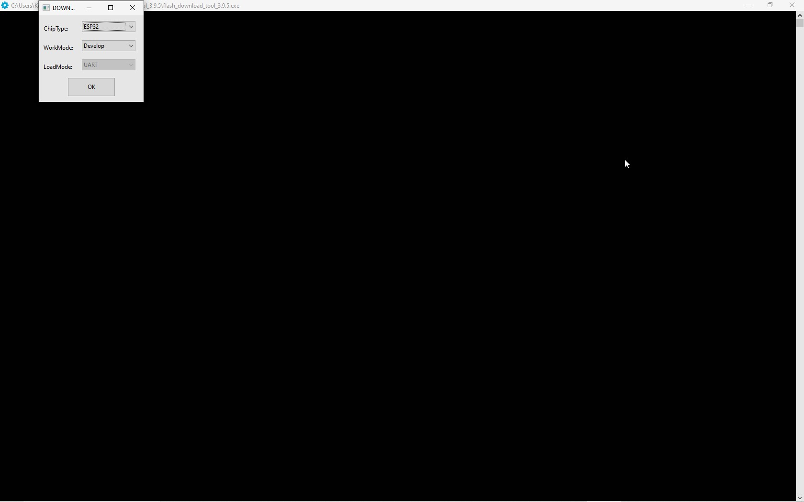
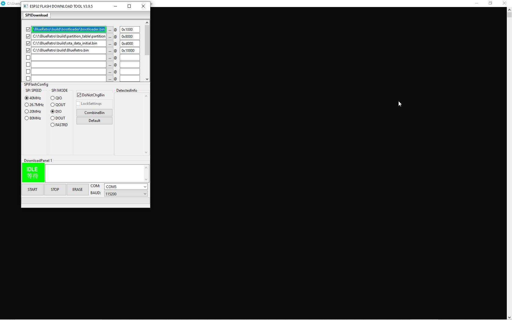

"Ready to go files"  for people who got problems with compilators, IDF etc(I know how annoying this could be), under Windows.
Just go to releases and download "Blueretro+Ogx360 *.zip" file.
## ESP32  part :
I am using esp32-wroom32d DevkitC V4. 
Dowload [flash download tool](https://www.espressif.com/sites/default/files/tools/flash_download_tool_3.9.5.zip) 
Run program and set :
Chip Type : ESP32
WorkMode : Develop

  

Put all downloaded bin files into flash tool (3 dots), and set everything like on this screen.

  

Change COM to Yours -  Determine what COM number Esp32 appears in the device manager.
Click START - and done.
## Arduino part :

* Download avrdude-6.3-mingw32.zip for Windows from  [avrdude](http://download.savannah.gnu.org/releases/avrdude/), and unzip it where you wish to.
*   Determine what COM number Arduino appears in the device manager.
* Go into command prompt in Windows, change folder to avrdudes folder
* write command:
avrdude -C avrdude.conf -F -p atmega32u4 -c avr109 -b 57600 -P COMx -Uflash:w:ogx360.hex:i
* !ALter COMx with Yours for arduino!
* Done.

* 
## Connections

Wiring
For Player 1: Connect right side pin6 (A2), and pin7 (A1) on the Arduino to ground(GND).

For Player 2: Connect right side pin7 (A1) on the Arduino to Ground.

For Player 3: Connect right side pin6 (A2) on the Arduino to Ground.

For Player 4: Don't connect any additional pins to ground.

  

Connect right side pin1 (RAW) on  all Arduinos together (it`s a main 5V for arduino), with left side bottom 5V pin on ESP32.

Connect  ground pins (GND) of all the boards together.

Connect left side pin8 (D2) on all Arduinos together.

Connect left side pin7 (D3) on all Arduinos together.

Connect right side pin22 (SCL) from Esp32 with Arduinos pin8 (D2).

Connect right side pin21 (SDA) from Esp32 with Arduinos pin7 (D3).

Connect Your arduino to xbox with Xbox Controller Port to MicroUSB cable.

  

BE AVARE: esp32 logic is 3,3Volt!.

Arduino pro micro (leonardo) needed for ogx360 is 16MHz version, 5Volt - that means his logic is also 5Volt!!.

I realized that after smth about hour of tests.  

Connecting those two, CAN DAMAGE YOUR ESP32!!!!

However it works - and the question is: for how much long??  it is not safe for esp32 3,3V logic.

Now I am using for safety Bidirectional Level shifter

like this one :

  

Just search for example "4 Channels IIC I2C Logic Level Converter Bi-Directional Module 3.3V to 5V Shifter for Arduino" in Your favourite shopping site.

Or ignore that, and jump into action in Your favourite ogXbox game.

## Update without level shifter

I have made some trick, and suprising - it works.

  After accidently shorted U2(LDO regulator), I remove it and  powered my "pro micro board" with 3,3V from esp32.  

On Arduino :take out cable from pin1 (RAW), and connect to pin4(Vcc).

ON esp32 : take out  cable from bottom left pin5V and connect it to top left pin 3V3.

In this configuration Esp32 need to be powered up over MicroUSB socket.

Now everything will be powered from Esp32 board over usb socket, onboard LDO lowers 5V to 3,3V - powering esp32 and over pin3v3 - Arduino/s 

SDA, SCL are now 3,3V logic.

From atmega32u datasheet stays that 16MHz version need to be powered with 5V, lower voltage means lower cpu clock. 

Coresponding to this diagram Arduino is working  now with 8MHz clock.

Ogx360 is written specialy for 16MHz version of Arduino. Now clock is lower, and i didnt feel any difference. 

So I do not know what have really changed in clocks settings, but Voltage is now safe for esp32. 

Need to make more test and compare to orginal version to see if something is slower, or worse.

